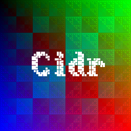

# Cidr
Cidr (pronounced "Sidr" which stands for "Simple Drawer" or "Simple Drawing") is (supposed to be) a simple header only library which you can use to easily draw simple stuff (simple geometric shapes such as lines squares etc, bitmaps and other simple stuff). All it requires is a simple pixel color buffer.

#### Cidr has following features
 * Lines (+ anti aliasing)
 * Circles (+ anti aliasing)
 * Rectangles 
 * Triangles 
 * Shaders for all shapes 
 * Bitmaps
 * Triangles with interpolated color 
 * Textured triangles
 * A simple vector library
 * And much more™ 

Here is a small demo of what you can already do with Cidr


## Building and running the demo
What you'll need:
* A C++17 compatible compiler
* SDL2
* CMake

Debian based: 
```bash
sudo apt install cmake libsdl2-dev g++
```
Mac: For g++ install [Xcode Command Line Tools](https://osxdaily.com/2014/02/12/install-command-line-tools-mac-os-x/), [homebrew](https://brew.sh/) and then run
```
brew install sdl2
brew install cmake
```
Windows: ¯\\\_(ツ)_/¯

In order to build, type this in your terminal:
```bash
$ mkdir build
$ cd build
$ cmake -G "Unix Makefiles" ..
$ make
```
And then run the demo
```
$ ./Cidr
```
The demo has an option for zoom:
```bash
./Cidr [zoom]
```
Example: This will launch the demo with 2x zoom:
```bash
$ ./Cidr 2
```
In order to switch between shaders, you can press the number keys between `1` and `4` (other number keys will disable the shader).
The arrow keys allow you to move the source position of the image and the textured triangles. 
By pressing keys from `5`-`8` you switch between "OutOfBound" modes and keys `9` and `0` switch between linear and bilinear interpolation.
Press `t` to turn off the text and `shift` + `t` to turn it back on.

## Usage
Just copy and paste the `cidr.hpp` file into your project and do this:
	
	#define CIDR_IMPLEMENTATION
	
in *one* C or C++ file to create the implementation before you include the `cidr.hpp` file. 

## Dependencies
All you need is a compiler that supports C++17.

## License 
This project is licensed under the [MIT License](https://www.tldrlegal.com/l/mit/)
