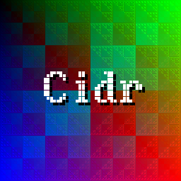

# Cidr
Cidr (pronounced "Sidr" which stands for "Simple Drawer" or "Simple Drawing") is (supposed to be) a *simple* header only 2D graphics library which you can use to  draw *simple* stuff (*simple* geometric shapes such as lines squares etc, bitmaps and other *simple* stuff). All it requires is a *simple* pixel color buffer. 

### Cidr has following features
 * Lines (+ anti aliasing)
 * Circles (+ anti aliasing)
 * Rectangles 
 * Triangles 
 * Shaders for all shapes 
 * Bitmaps
 * Triangles with interpolated color 
 * Textured triangles
 * A simple vector library
 * [stb_image](https://github.com/nothings/stb) for image loading and saving
 * And much more™ 

### Possibly upcoming features
 * Splines
 * Stroke thickness 
 * Rounded rectangles

Here is a small demo of what you can already do with Cidr


## Building and running the demo
What you'll need:
* A C++17 compatible compiler
* SDL2
* CMake

Debian based: 
```bash
sudo apt install cmake libsdl2-dev g++
```
Mac: Install [Xcode Command Line Tools](https://osxdaily.com/2014/02/12/install-command-line-tools-mac-os-x/), [homebrew](https://brew.sh/) and then run
```
brew install sdl2
brew install cmake
```
Windows: ¯\\\_(ツ)_/¯

In order to build, type this in your terminal from the `Cidr/` direcotry:
```bash
$ mkdir build
$ cd build
$ cmake -G "Unix Makefiles" ..
$ make
```
And then run the demo
```
$ ./Cidr
```
The demo has an option for zoom:
```bash
./Cidr [zoom]
```
In order to switch between shaders, you can press the number keys between `1` and `4` (other number keys will disable the shader).
The arrow keys allow you to move the source position of the image and the textured triangles. 
By pressing keys from `5`-`8` you switch between "OutOfBound" modes and keys `9` and `0` switch between linear and bilinear interpolation.
Press `t` to turn off the text and `shift` + `t` to turn it back on.

## Usage
Just copy and paste the `cidr.hpp` file into your project and do this:
	
	#define CIDR_IMPLEMENTATION
	
in *one* C++ file to create the implementation before you include the `cidr.hpp` file. 

## Sample code
This code creates and saves an image with the text "cidr" drawn on it. The resulting picture is similar to what you see at the top of the readme.
```cpp
// Create a bitmap to which we want to draw something
cdr::Bitmap myBitmap{256, 256};
// Create a rendere and pass the pixels of the just created bitmap to the renderer
cdr::Renderer myBitmapRenderer{myBitmap.GetData(), myBitmap.GetWidth(), myBitmap.GetHeight()};
for (uint32_t x = 0; x < 256; x++) {
    for (uint32_t y = 0; y < 256; y++) {
		// Drawing a pixel on the bitmap with some "bit hackry"
        myBitmap.SetRawPixel(
            (y & (x^~y)) >> (~x&~y) | ((y & (x^~y))),
            (x & (x^y) ) >> (~x& y) | ((x & (x^y) )),
            (y & (x^y) ) >> ( x&~y) | ((y & (x^y) )),
            0xff, x, y);
    }
}

// Set text style
myBitmapRenderer.SetTextFont(cdr::Fonts::Raster8x16);
myBitmapRenderer.SetTextAlignment(cdr::TextAlignment::CC);
myBitmapRenderer.SetTextSize(4);
myBitmapRenderer.SetTextShadowColor(cdr::RGB::Black);
// Drawing text
myBitmapRenderer.DrawText("Cidr", 132, 128);

// Save the edited bitmap as "myBitmap.png"
myBitmap.SaveAs("myBitmap", cdr::Bitmap::Formats::PNG);
```
## Dependencies
All you need is a compiler that supports C++17.

## License 
This project is licensed under the [MIT License](https://www.tldrlegal.com/l/mit/)
